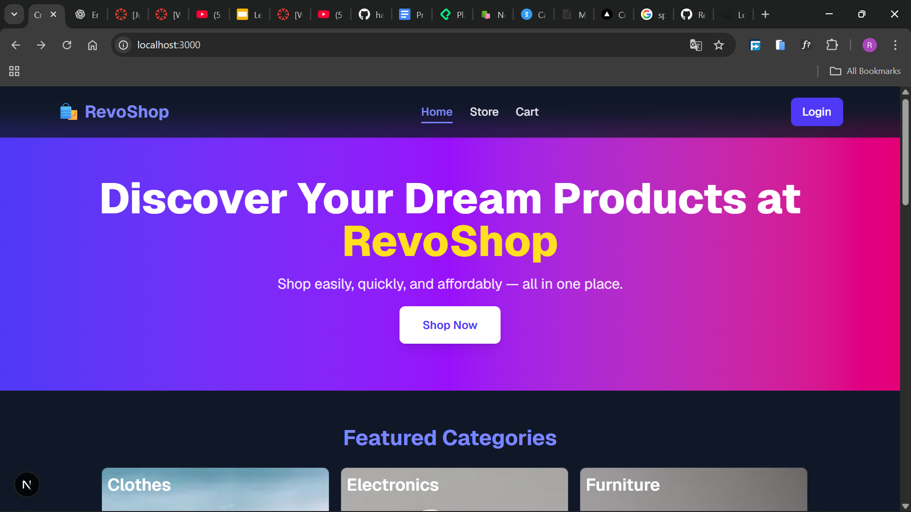
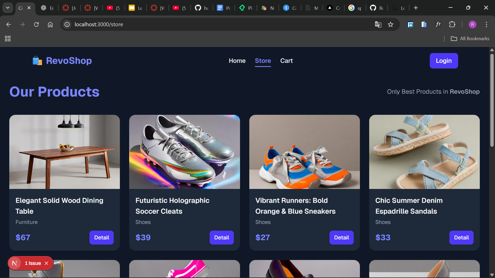
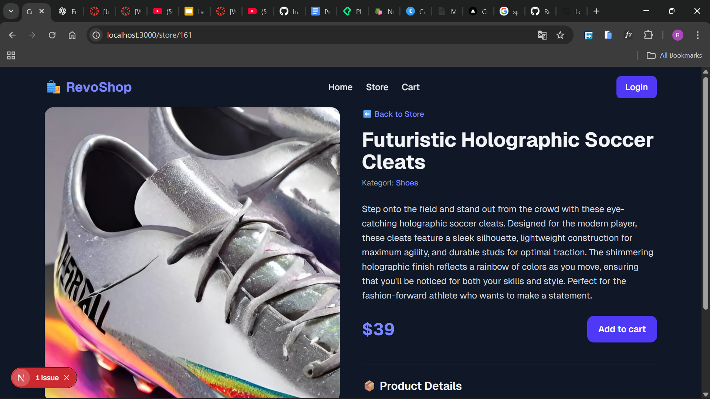
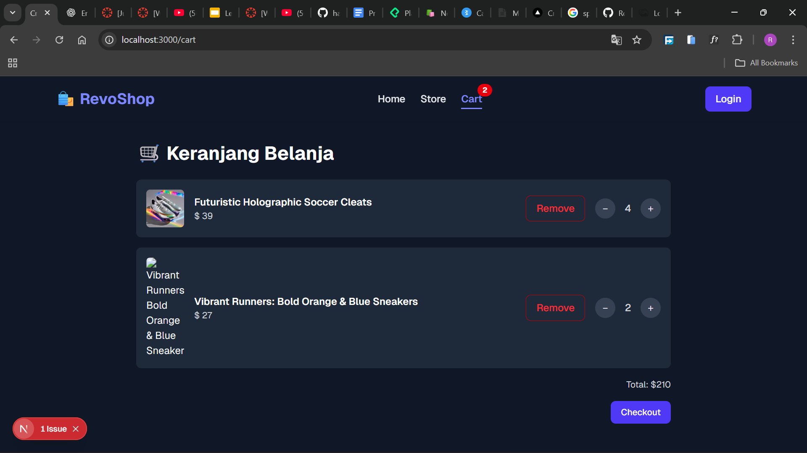
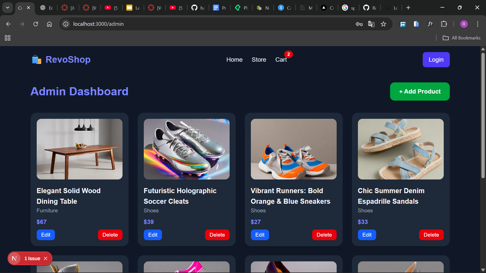
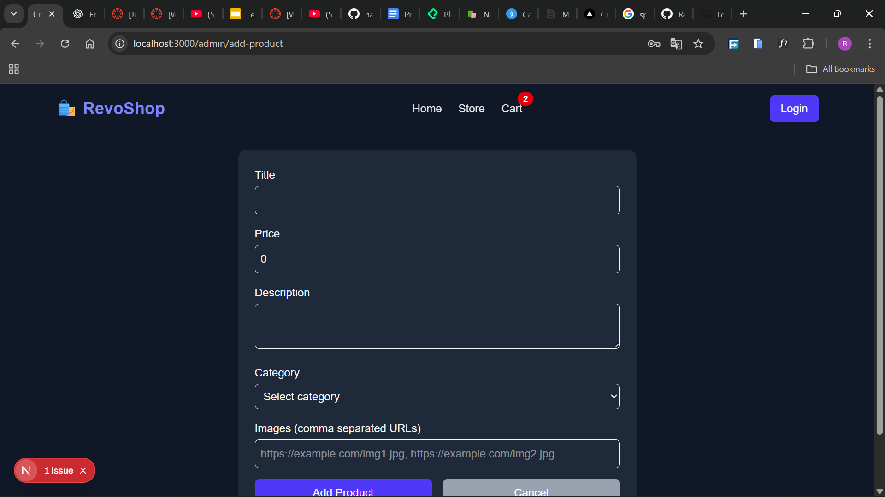
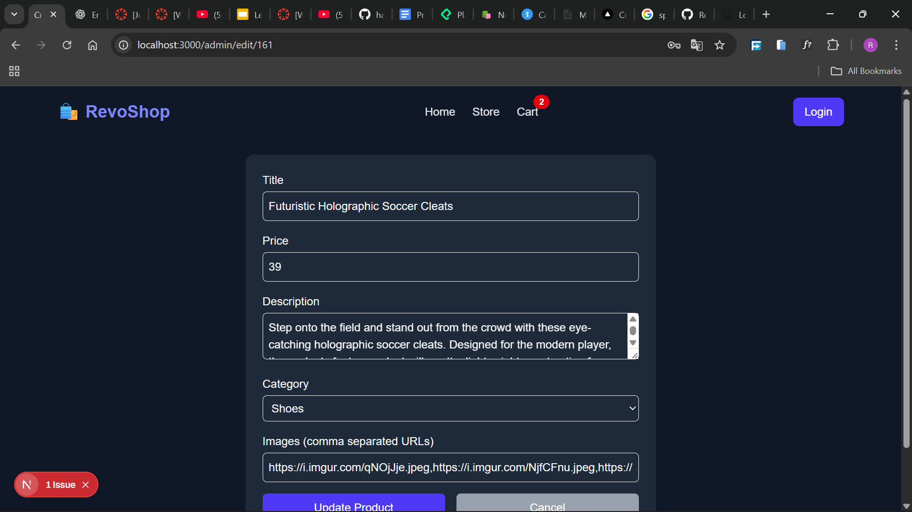

[](https://classroom.github.com/a/oWpYBV3N)

# RevoShop E-Commerce

## Overview

This project is an simple **E-Commerce Web** built using **Next.js** with **TypeScript** and **Tailwind CSS**.  
It provides a platform for all users to browse products, view details, and for admins to manage products including create, update, and delete. The project integrates with a public API (**Platzi Fake Store API**) to fetch product and category data.

## Features Implemented

| Feature         | Description                                                 | Access    |
| --------------- | ----------------------------------------------------------- | --------- |
| Authentication  | Simple user login and logout with platzi api                | All users |
| Product Listing | Displays all products with images, price, and category      | All users |
| Product Details | View detailed information for a single product              | All users |
| Search & Filter | Search products by name or filter by category               | All users |
| Add Product     | Create new products with title, price, category, and images | Admin     |
| Edit Product    | Update existing product information                         | Admin     |

## Technologies Used

- **Next.js (App Router)** – Server-side rendering and routing
- **React 18+** – UI components and state management
- **TypeScript** – Type safety for components and API data
- **Tailwind CSS** – Styling and responsive design
- **React Hook Form** – Form management and validation
- **Axios / Fetch API** – Handling HTTP requests
- **API** – [Platzi Fake Store API](https://fakeapi.platzi.com/) for products and categories

## Setup Instructions

1. Clone the repository:

```bash
git clone <repository-url>
```

2. Install Depedency:

```bash
npm install
# or
yarn install
```

3. Run the development server:

```bash
npm run dev
# or
yarn dev
```

4. Open http://localhost:3000 in your browser.

## Screenshots / Demo

### Home Page



### Store Page



### Product Detail



### Cart Page



### Admin Dashboard



### Add Product



### Edit Product



## Web URL

you can see the live website from:
[RevoShop](https://milestone-3-rizaldi87.vercel.app/)
